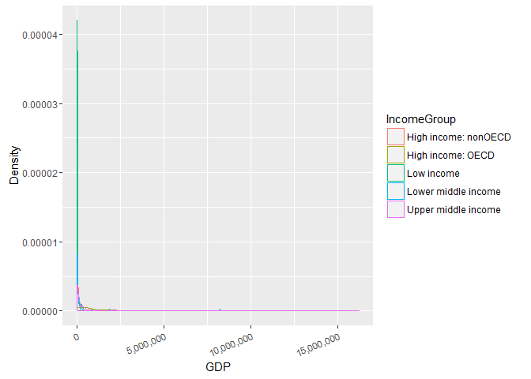

``` r
  knitr::opts_chunk$set(echo = TRUE,warning=FALSE)
```

Introduction
============

The purpose of this study is to analyze two sets of data from the world bank: GDP and Education stastics. We will first download the two datasets from the world bank website. We will then tidy up both sets of data and merge the two on the CountryCode variable. After our data is tidy and merged, we will perform analysis on the data. Our hope, is through this analysis, we can gather insight into countries Gross Domestic Product’s, income group categorization, and ranking.

Prerequisites
=============

-   The following packages are required to run the code below:

``` r
library(knitr)
library(ggplot2)
library(scales)
```

Note, the libraris are also loaded in the source files. This ensures the files will run on their own, outside of this report.

Gather Data
===========

-   Rather than writing R code directly in the markdown, I choose to use read\_chunk, to read in the R code from another source file. I like read\_chunk, as it allows you to bring in only the portion of the code you want.

``` r
knitr::read_chunk('gather.R')
```

-   Download the GDP and Education csv files into the data directory

``` r
#Load Libraries
library(downloader)

#Download GDP Data
url<-"https://d396qusza40orc.cloudfront.net/getdata%2Fdata%2FEDSTATS_Country.csv"
download.file(url,destfile="FEDSTATS_Country.raw.csv") 

#Download Educ Data
url<-"https://d396qusza40orc.cloudfront.net/getdata%2Fdata%2FGDP.csv"
download.file(url,destfile="FGDP.raw.csv") 
```

Tidy and Merge Data
===================

-   Load R code from file Tidy&Merge.R.

``` r
knitr::read_chunk('Tidy&Merge.R')
```

### Load GDP Data

-   Plyr library is load to use rename function

``` r
library(plyr)
```

-   Set file paths of data files

``` r
GDPFile <- "FGDP.raw.csv"
EDFile <- "FEDSTATS_Country.raw.csv"
```

-   Read GDP data in as CSV format

``` r
#load data from CSV files
GDP <- read.csv(GDPFile)
```

-   The raw data contained a header at the top of the

``` r
#remove header and footer at the bottom of page
GDP.NHF<- GDP[5:235,]
```

-   Use plyr's rename function to rename X column names imported from CSV

``` r
#Update column names
GDP.NHF.CN <-rename(GDP.NHF, c("X"="CountryCode","Gross.domestic.product.2012" ="Ranking"
                    ,"X.2"="Country","X.3"="GDP","X.4" = "Category"))
```

-   Replace null and empty string values with NA

``` r
#Replace empty strings with NA
GDP.NHF.CN[GDP.NHF.CN==""] <- NA

#Keep only the columns we need
GDP.NHF.CN.DC <- GDP.NHF.CN[c("CountryCode","Ranking","Country","GDP","Category")]

#remove rows that do not have rankings
GDP.Final <- GDP.NHF.CN.DC[!(is.na(GDP.NHF.CN.DC$Ranking)), ]
```

Load Ed Data
------------

-   Read Fedstat country data from CSV file

``` r
#Load Edstats data
edstats <- read.csv(EDFile)
```

-   After the CSV important. Lots of the values were null or empty strings. We will replace null and empty string values with NA

``` r
#Replace empty string with NA
edstats[edstats == ""] <- NA
```

-   Merge GDP and Fedstat data on CountryCode

``` r
#Merge Data
mergeddata <- merge( GDP.Final, edstats,by="CountryCode")
```

-   Only keep columns needed Country Code, Ranking, GDP, Long Name and Income Group

``` r
#Only keep the columns we need
mergeddata.small <- mergeddata[c("CountryCode","Ranking","GDP","Long.Name","Income.Group")]

# --- EdRenameColumns ---
#rename long.name and Income.Group to keep consistent
mergeddata.small <-rename(mergeddata.small, c("Long.Name"="LongName","Income.Group"="IncomeGroup"))

# --- EdConvertColumns ---
#Convert ranking from factor to numeric
mergeddata.small$Ranking <- as.numeric(levels(mergeddata.small$Ranking))[mergeddata.small$Ranking]

#Convert LongName from factor to char
mergeddata.small$LongName <- as.character(levels(mergeddata.small$LongName))[mergeddata.small$LongName]

#Remove commas from GDP
mergeddata.small$GDP <-gsub(",", "", mergeddata.small$GDP)

#Convert GDP from factor to numeric
mergeddata.small$GDP <- as.numeric(mergeddata.small$GDP)
```

-   Remove "." in column names to keep them consistent

-   Convert Ranking and GDP columns from factor to numeric. Convert Long.Name from factor to character data type.

Analyze
=======

Now that our data is downloaded, tidy, and merged. We can move on the analysis portion of the case study.

We will start by reading in R code from Analyze.R. This file contains the answers to the questions of interest for the case study.

``` r
knitr::read_chunk('Analyze.r')
```

-   Merge the data based on the country shortcode. How many of the IDs match?

``` r
#Question 1
length(mergeddata$CountryCode)
```

    ## [1] 189

-   Sort the data frame in ascending order by GDP (so United States is last). What is the 13th country in the resulting data frame?

``` r
#Quesion 2
mergeddata.small.sorted <- mergeddata.small[with(mergeddata.small,order(-Ranking)),]

#13th element
mergeddata.small.sorted[13,]
```

    ##    CountryCode Ranking GDP            LongName         IncomeGroup
    ## 93         KNA     178 767 St. Kitts and Nevis Upper middle income

-   What are the average GDP rankings for the "High income: OECD" and "High income: nonOECD" groups?

``` r
#Question 3
incomeAgg <- aggregate(mergeddata.small.sorted, by=list(mergeddata.small.sorted$IncomeGroup), FUN=mean, na.rm=TRUE)
incomeAgg <- incomeAgg[c("Group.1","Ranking","GDP")]  
incomeAgg <- rename(incomeAgg, c("Group.1"="IncomeGroup","GDP"="MeanGDP","Ranking"="MeanRanking"))
incomeAgg <- incomeAgg[with(incomeAgg,order(MeanRanking)),]
incomeAgg
```

    ##            IncomeGroup MeanRanking    MeanGDP
    ## 2    High income: OECD    32.96667 1483917.13
    ## 1 High income: nonOECD    91.91304  104349.83
    ## 5  Upper middle income    92.13333  231847.84
    ## 4  Lower middle income   107.70370  256663.48
    ## 3           Low income   133.72973   14410.78

``` r
#str(incomeAgg)
#head(mergeddata.small.sorted)
```

-   Plot the GDP for all of the countries. Use ggplot2 to color your plot by Income Group

``` r
#Question 4
ggplot(mergeddata.small.sorted, aes(GDP, colour = IncomeGroup)) + 
  geom_density() + 
  scale_x_continuous(name="GDP",label = comma) +
  scale_y_continuous(name="Density",label = comma) +
  theme(axis.text.x = element_text(angle = 22.5, hjust = 1))
```

 Note, I spent a considerable time on this question. I tried numerous plots: scatter, bar, dot plot, and box plot. At the end, the outliers in the data, namely, the USA. Forced the range the x-axis to be so long, that it's difficult to make out the smaller GDPs. I considered a log transformation, but I don’t know how useful that would be to the person interrupting the data.

-   Cut the GDP ranking into 5 separate quantile groups. Make a table versus Income.Group. How many countries are Lower middle income but among the 38 nations with highest GDP

``` r
#Question 5
rankedquantiles <- cut(mergeddata.small.sorted$Ranking,breaks=5)
quant <- table(mergeddata.small.sorted$IncomeGroup,rankedquantiles)
quant
```

    ##                       rankedquantiles
    ##                        (0.811,38.8] (38.8,76.6] (76.6,114] (114,152]
    ##                                   0           0          0         0
    ##   High income: nonOECD            4           5          8         4
    ##   High income: OECD              18          10          1         1
    ##   Low income                      0           1          9        16
    ##   Lower middle income             5          13         12         8
    ##   Upper middle income            11           9          8         8
    ##                       rankedquantiles
    ##                        (152,190]
    ##                                0
    ##   High income: nonOECD         2
    ##   High income: OECD            0
    ##   Low income                  11
    ##   Lower middle income         16
    ##   Upper middle income          9

Summary
=======

There are a few take always from this analysis. First, how data tidying took a considerable amount of time. I would estimate it took over a little over half the amount of time spent on this project. Second, the amount of ancillary information found in the CSV files was surprising. The GDP data, in particular, had several notes and addendums included in the CSV file. I'm surprised whoever was hosting that data would leave that in there. I would assume anyone using that data would have to remove that information. Third, within the actual data, it was surprising how much of a variances exists in the higher income groups. I believe this is evident, by noticing the upper middle income group in the plot above. Fifth, speaking of the plat, second only the data tidying, a considerable amount of time was spent finding a plot that made sense. If some of the outliers, like the USA, could be removed, it would make the plot much more readable.
